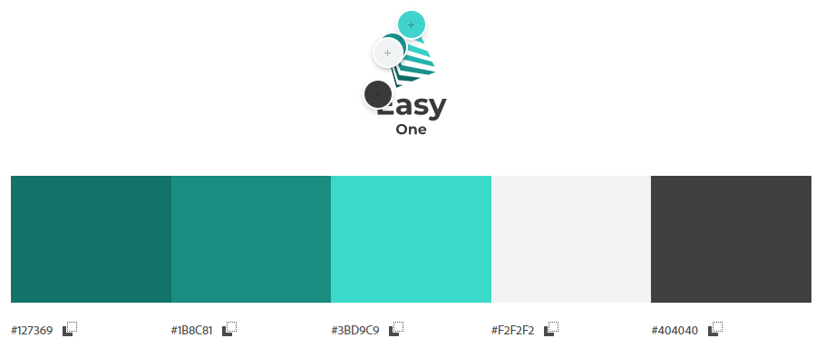

# primeiras-paginas-web-2022

> Status: Em Desenvolvimento

## Versão 1.0
- [x] Modelo básico no Figma: https://www.figma.com/file/7Xhdm8LsVsZEI0pGh978yf/EasyOne-Site?node-id=3%3A2
- [x] Cabeçalho;
    - [ ] Responsivo para mobile
- [x] Carregar dados de veículos;
- [x] Cartão de produtos;
- [x] Ajuste do corpo e conteúdo;
- [x] Reações de estilo;
- [x] Favoritar carro;
    - [ ] Substituíção por input check (será melhor)
- [x] Filtro por categoria;
- [ ] Filtro por nome.

## Paleta de cores

<table>
    <tr>
        <td>#127369</td>
        <td>#1B8C81</td>
        <td>#3BD9C9</td>
        <td>#F2F2F2</td>
        <td>#404040</td>
    </tr>
</table>

## Fontes
* Logo: https://pt.freelogodesign.org/
* Paleta de cores: https://color.adobe.com/pt/
* Ícones: https://www.flaticon.com/search?word=favorite%20car&order_by=4
* Imagens dos carros: https://www.movidazerokm.com.br/